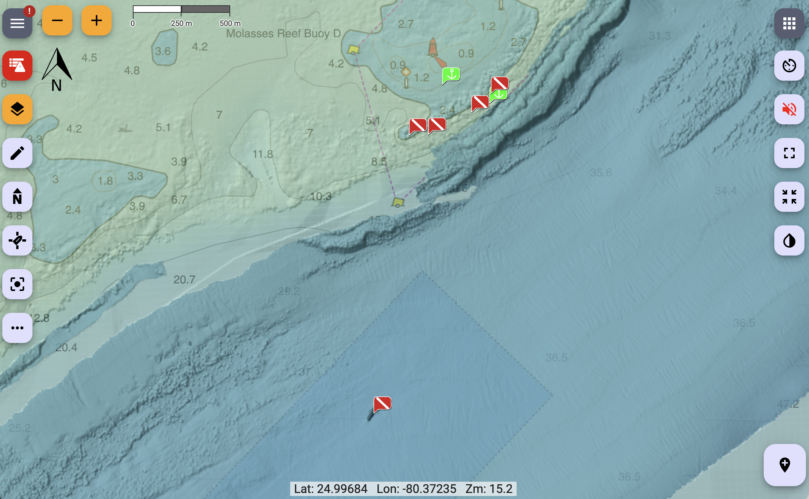
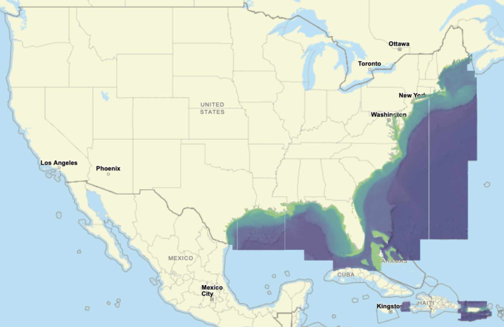

# signalk-noaa-sonar-charts



A Signal K chart provider for high resolution underwater relief charts around the eastern
United States and parts of the Caribbean. It adds three chart layers to Freeboard-SK and serves their tiles
from local caches, fetching any missing tile from NOAA on demand and saving it 
so the charts **work offline** from whatever you've already viewed.

| Chart | Description |
|---|---|
| **NOAA Hi-Res Relief** | High resolution relief (coverage limited) |
| **BlueTopo Relief** | Mid resolution underwater relief |
| **BlueTopo Depth Color** | Colorized depth indicator |

The layers are pre-baked with set opacities so they should play well with other layers with minimal configuration. The two BlueTopo layers have **land masked out** (made transparent) so they don't
cover the land features of your base chart. If you have any difficulties, change the stack order. The HiRes relief is best when its the top layer.

## Coverage area


## Requirements

- Signal K server with Freeboard-SK v2 or later.
- Node.js ≥ 22.5.0.

## Installation

Locate the plugin in the Signal K App Store and install from there. 

Then **restart Signal K** and enable the plugin under **Server → Plugin Config →
"NOAA Sonar Chart Provider"**. The three charts appear in Freeboard's chart list.

## Configuration

| Setting | Default | Notes |
|---|---|---|
| Download missing tiles dynamically | on | Disable for offline viewing (serve only tiles already cached). |
| Baked layer opacity (advanced) | 0.75 / 0.50 / 0.30 | Per-layer opacity baked into the tiles so the layers stack well. Most users won't change these. |

Tile caches are stored in the plugin's data directory
(`<signalk-config>/plugin-config-data/noaa-sonar-chart-provider/`).

## Land masking (one-time download)

To mask out land, the plugin downloads a worldwide coastline dataset the first
time it runs (stored in the plugin's data directory). It's a large, one-time
download that happens automatically in the background; until it finishes, the
BlueTopo layers are shown without land masking. On a slow connection you can
pre-build this dataset on another computer and copy it over — see
[AGENTS.md](AGENTS.md).

## Pre-loading an area (optional)

By default, tiles are fetched as you view them. To pre-load an area in advance
(e.g. before heading offline), use the bundled `noaa-sonar-charts` command from
your Signal K configuration directory:

```bash
cd ~/.signalk
npx noaa-sonar-charts --bbox -82.0 24.4 -80.05 25.6
```

`--bbox` is **west south east north** in decimal degrees (WGS84) — west/east are
longitude, south/north are latitude, and western longitudes / southern latitudes
are negative. The example above covers the Florida Keys.

It pre-loads all three layers by default. Choose layers with `+`/`-` (default
`+all`): e.g. `-all +color` for only Depth Color, or `+all -hi` to skip the
hi-res layer. Other options: `--min-zoom`, `--max-zoom`, `--workers`, `--dir`.
Run `npx noaa-sonar-charts` with no arguments for full help.

It is resumable and additive — re-run it to extend the area or add zoom levels.

## Data sources & attribution

- NOAA NCEI bathymetric sonar (BAG hillshade subsets).
- NOAA Office of Coast Survey **BlueTopo** via nowCOAST.
- Coastline: OpenStreetMap land polygons (© OpenStreetMap contributors, ODbL).

NOAA data is in the public domain. **This plugin is not for navigation.**

## License

Apache-2.0.

Developers: see [AGENTS.md](AGENTS.md) for architecture, build/development setup,
and implementation notes.
